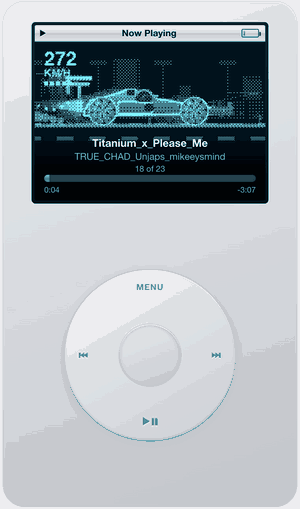
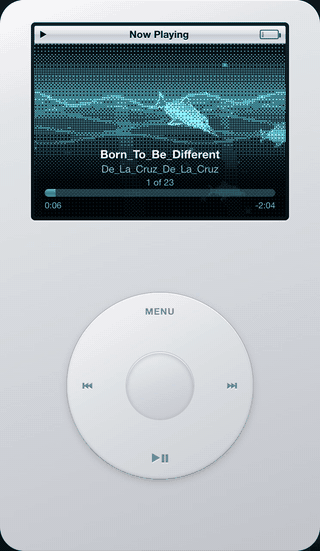
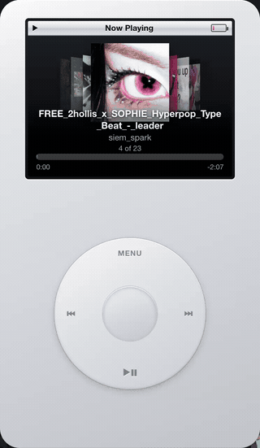
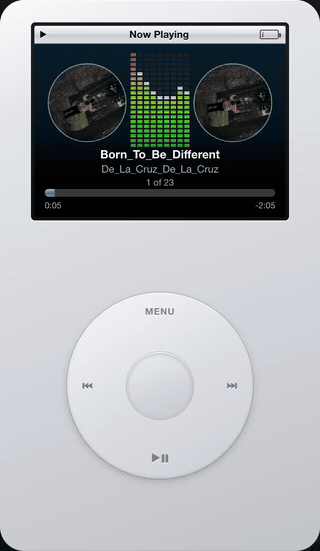
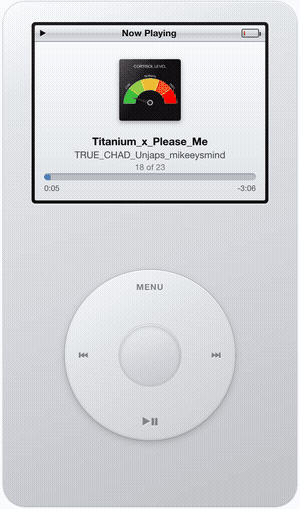
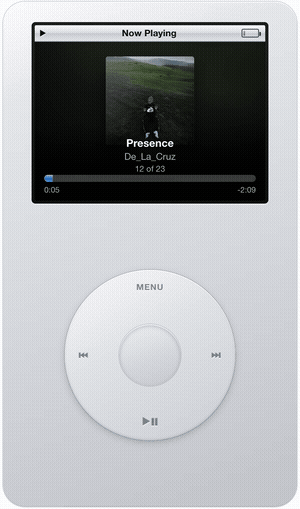
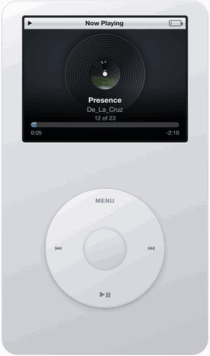
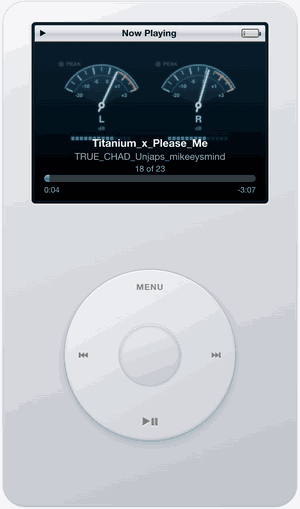
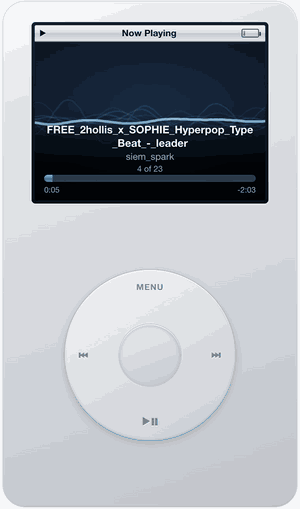
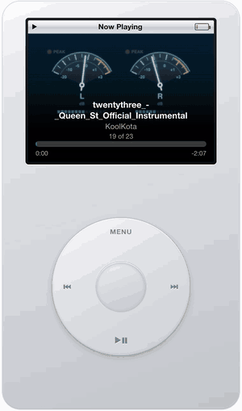

# iPod Player

A native macOS music player shaped like an iPod Classic — with dithered visualizers
lifted from old Pioneer car head units.

| | |
|---|---|
|  |  |
|  |  |

I never owned an iPod. I built this from memory and photographs because I wanted
that wheel on my desktop. The visualizers and the downloader grew out of it later.

## What it does

- Plays your local library from `~/Music/iPod` — no account, no streaming service.
- A click wheel you actually drag: scrolling is angular, the zones are Menu, prev,
  next and play/pause, the centre button selects.
- Cover Flow both as a library view and as a playback screen, with covers sliding
  as the track changes.
- Ten playback screens, from a plain classic layout to full-screen animations
  rendered on canvas and pushed through a 4×4 Bayer dither, which is what gives
  them that car-display look.
- Optional downloading through `yt-dlp`, including Spotify links used purely as a
  list of titles.
- Interface in 29 languages, picked from your system settings.

## Playback screens

| | |
|---|---|
| <br>**Classic** — cover, title, progress. The plain one. | <br>**Full cover** — artwork edge to edge over a blurred backdrop. |
| <br>**Cover Flow** — the accordion of covers, centred on what is playing. | <br>**Vinyl** — artwork as a label on a spinning record. |
| <br>**Dolphins** — four rotating underwater scenes: a breach, a pod, the deep, a mirrored pair. | <br>**Race car** — speeds up with the song, camera cutting between side, front and rear. |
| <br>**VU meters** — needles with inertia, peak lamps, a dB scale. | <br>**Turntables** — two decks at their own pace, colour equaliser between them. |
| <br>**Waves** — a slow-motion oscilloscope trailing its own history. | <br>**Random** — draws a different screen for every track. |

The race car and the dolphins follow the music: a smoothed energy reading drives
the speed, and the bass drives the exhaust flame.

## Requirements

- macOS on Apple silicon.
- [`yt-dlp`](https://github.com/yt-dlp/yt-dlp) — **only** if you want the download
  screen. It is not bundled; install it yourself with `brew install yt-dlp`.
- `ffmpeg` — optional. Without it the player still works, but cover art is not
  embedded into files and broken containers are not repaired. `brew install ffmpeg`.

## Install

Grab the DMG from [Releases](../../releases) and drag the app to Applications.

The build is signed ad-hoc but not notarized, so macOS blocks the first launch.
Right-click the app, choose **Open**, then confirm. You only do this once.

## Build from source

```bash
npm install
npm start          # run it
npm run build      # DMG in dist/
node test.js       # unit tests for the pure logic
```

## Controls

| Wheel | Keyboard |
|---|---|
| Drag around the wheel — scroll | ↑ ↓ |
| Centre button — select, play/pause | Enter, Space |
| Top zone — back | Esc |
| Left / right zones — previous / next | ← → |
| Drag on Now Playing — volume | ↑ ↓ |
| | ⌘O — next playback screen |

## Languages

The interface follows your system language and can be changed in Settings; the
choice is remembered. English fills any gap, so a partial translation never leaves
a blank label.

Adding a language means one block in [`i18n.js`](i18n.js) — a code, a name in that
language, and 60 strings. Pull requests welcome.

Currently: English, Bahasa Indonesia, Bahasa Melayu, Català, Čeština, Dansk,
Deutsch, Español, Français, Hrvatski, Italiano, Magyar, Nederlands, Norsk bokmål,
Polski, Português, Português (Brasil), Română, Slovenčina, Suomi, Svenska,
Türkçe, Ελληνικά, Русский, Українська, 한국어, 日本語, 简体中文, 繁體中文.

## Downloading

The download screen shells out to `yt-dlp`, which this project neither bundles nor
ships. Installing it and staying within the terms of the services you use is on
you. A Spotify link is read only for its public list of titles — nothing is ever
pulled from Spotify itself, the audio still comes from YouTube.

If downloads start failing with a 403, `yt-dlp` is usually out of date:
`brew upgrade yt-dlp`.

## Licence

MIT — see [LICENSE](LICENSE).

Not affiliated with or endorsed by Apple Inc. iPod is a trademark of Apple Inc.
This is a hobby project that imitates the look of a discontinued device.
